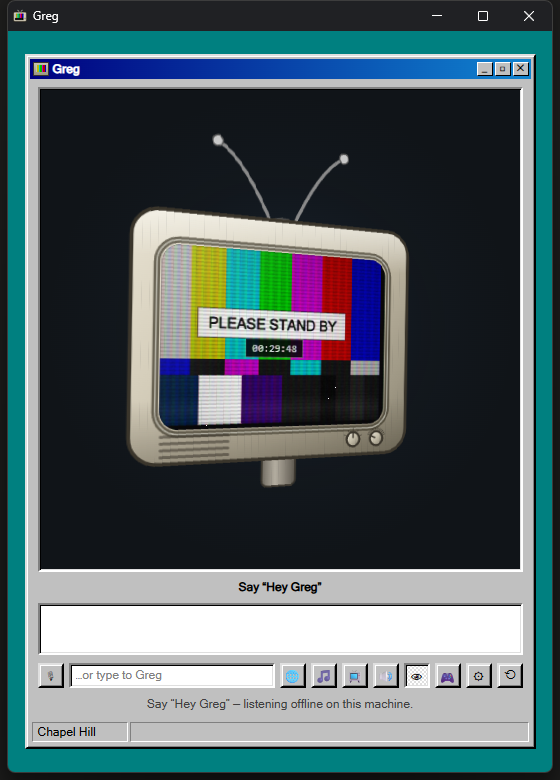

# Greg

A local AI buddy with a face, a voice, and ears. Say **"Hey Greg"** and he answers out loud.



*Idling on channel 1. The clock is his uptime, the row of buttons along the bottom
is everything he can be told to do with a mouse, and the picture reacts to his
voice and yours.*

- **Hears you** — always listening for the wake word, no button press
- **Talks back** — a natural neural voice, not a robot, and he starts before he's finished writing
- **Lets you cut in** — talk over him to stop him, and ask a follow-up without saying his name again
- **Knows your weather** — real conditions and forecast for wherever you are
- **Reads your local news** — headlines from your actual city
- **Holds a conversation** — a real language model, running on your own PC
- **Has a face** — a floating TV head whose picture reacts to your voice and his own

**No API key. No account. No subscription.** His brain, his ears *and* his voice all run entirely on your own machine. Nothing you say — and nothing he says — is sent anywhere. Unplug the internet and he still talks to you; he just can't look up the weather or the news.

---

## What you need

**Windows 10 or 11.** Greg is Windows-only today. He leans on PowerShell for
screen capture and the media session, on Windows' own speech as a fallback
voice, and he ships `.bat` launchers. Nothing in the design prevents a Linux or
macOS port — most of the code is plain Node and browser JavaScript, with only a
handful of modules touching Windows — but nobody has written one.

**Node.js 20 or newer.** The only piece that is genuinely required. Everything
else on this page is optional.

**Chrome or Edge.** Edge ships with Windows, so you almost certainly already
have one. Firefox works for most things but has no speech recognition of its
own, so you would need the offline ears below.

**Disk space, only if you want him local.** Nothing extra to run him at all;
about 10 GB for a brain on your own machine, around 16 GB for everything
including his eyes.

**An NVIDIA card is optional.** Hearing works on the CPU and is perfectly
usable. A card mainly buys you fast screen vision and the cloned voice; ~6 GB of
video memory is comfortable for the brain alone, ~12 GB if you want the eyes
open at the same time.

## Setting him up

Double-click **`setup-greg.bat`**. It looks at what your machine already has,
asks which pieces you want with the download size next to each, installs them,
and then tells you honestly what worked.

Want to see what it would do without it doing anything? Open a terminal here and
run:

```bash
powershell -NoProfile -ExecutionPolicy Bypass -File setup-greg.ps1 -DryRun
```

**None of it is required.** Greg is built to degrade rather than fail: with
nothing but Node.js he still runs, still holds a conversation, still shows you
the weather — he just borrows a cloud voice and the browser's own speech
recognition to do it, and his startup screen says so in amber rather than
pretending. Everything below is about taking pieces off other people's servers
and putting them on your machine.

| What | You get | Download |
|---|---|---|
| **Node.js 20+** | Greg runs at all. The only thing that isn't optional. | 30 MB |
| **Ollama + `gemma4:e4b`** | A real brain, on your own machine. | 9.6 GB |
| **Python 3 + `faster-whisper`** | He hears you offline. | 200 MB |
| **`piper-tts`** | He speaks offline. Voices download themselves on first use. | 100 MB |
| **`qwen2.5vl:7b`** | He can look at your screen. | 5.9 GB |
| **CUDA runtime packages** | The ears run on your NVIDIA card instead of the CPU. Offered only if you have one. | 1 GB |

The setup script drives [winget](https://learn.microsoft.com/windows/package-manager/),
which ships with Windows 11 and recent Windows 10. Without it the script still
runs and still tells you what's missing — it just prints the download links
instead of fetching anything.

### Doing it by hand

If the script fails on a step, or you'd rather do it yourself:

```bash
winget install --id OpenJS.NodeJS.LTS --exact
winget install --id Ollama.Ollama --exact
winget install --id Python.Python.3.12 --exact
```

Then, in a **new** terminal — freshly installed programs aren't on the old one's
PATH:

```bash
ollama pull gemma4:e4b
py -3 -m pip install faster-whisper piper-tts
```

And if you have an NVIDIA card and want the ears on it:

```bash
py -3 -m pip install nvidia-cublas-cu12 nvidia-cudnn-cu12 nvidia-cuda-runtime-cu12
```

### The cloned voice is the one thing setup can't finish

Greg can speak in a cloned voice, and the setup script will install the machinery
for it with `-Clone`. It cannot finish the job, and it says so rather than
appearing to succeed: cloning needs about ten seconds of a real person's
recording saved as `voices/greg-reference.wav`, and nothing ships one — that
would mean publishing somebody's voice. Record your own, or leave it off and keep
Piper.

It also needs **Python 3.12 exactly**, because `torch==2.6.0` has no wheels for
anything newer, and the `py` launcher often can't see a 3.12 even when one is
installed. Both are checked before anything is downloaded.

## Start him up

Double-click **`start-greg.bat`**.

A window opens with Greg's face. Click **Wake Greg**, allow microphone access when the browser asks, and say:

> "Hey Greg, what's the weather?"

The set warms up first — the tube strikes, a startup screen counts the memory and
lists what actually loaded, and a Windows 98 splash comes up. About four seconds,
and you can click straight through it. Everything on that screen is real: if your
ears or voice fell back to a cloud service, it says so in amber rather than
pretending. Add `?boot=0` to the address to skip it for good.

**First time?** Nothing to do. On the first run he creates `config.json` from
`config.example.json` and says so on the console — that's where his name, your
location, his voice and everything else live. Nothing in it is required to get
started; he detects your city on his own and picks the best brain, ears and voice
he can find on your machine. `config.json` is yours and is never published: it's
gitignored, because it ends up holding your coordinates.

## Shut him down

Double-click **`stop-greg.bat`**. It tells you whether he was running and confirms when he's off.

## The rest of it

There is a lot more than the list at the top: fourteen channels, screen vision
that refuses to pretend, music that ducks under his voice, personas he can
become on request, and files he can read but never write. It lives in five
pages rather than on this one, so this page stays readable:

- **[His face and his channels](docs/channels.md)** — the television, all fourteen channels, the Global Dashboard
- **[Talking to Greg](docs/talking-to-greg.md)** — how a conversation flows, things to say, personality and personas
- **[What else he can do](docs/features.md)** — screen vision, music, files, subtitles, volume
- **[Configuration](docs/configuration.md)** — every setting, and which need a restart
- **[Troubleshooting](docs/troubleshooting.md)** — when something is not working

And **[DECISIONS.md](DECISIONS.md)** records the settings that look like obvious
improvements and are not, each with the measurement that settled it. Read that
one before changing anything in `config.json` you think is wasteful.

## Credits

Greg was built by **BakeryBread66**.

## Licence

Greg is MIT licensed — see [LICENSE](LICENSE). Use it, change it, sell it; keep
the copyright notice.

That covers the code in this repository and nothing else. Greg is mostly a
conductor for other people's work, and the pieces that do the heavy lifting are
separate projects under their own terms:

**Installed by `npm install`, and served to the browser from `node_modules`.**
Verified MIT at the versions pinned in `package-lock.json`:
[three.js](https://github.com/mrdoob/three.js),
[globe.gl](https://github.com/vasturiano/globe.gl),
[three-globe](https://github.com/vasturiano/three-globe) and the
[Anthropic SDK](https://github.com/anthropics/anthropic-sdk-typescript). The
country outlines the dashboard draws come from
[Natural Earth](https://www.naturalearthdata.com/), which is public domain.

**Installed with `pip`, and run as sidecar processes.** Not vendored here, and
each carries its own licence — check them before you redistribute anything built
on top: [faster-whisper](https://github.com/SYSTRAN/faster-whisper) for the ears,
[Piper](https://github.com/OHF-Voice/piper1-gpl) for the local voice,
[Chatterbox](https://github.com/resemble-ai/chatterbox) for the cloned one, and
[PyTorch](https://pytorch.org/) underneath it.

**Voice models are their own thing again.** Piper downloads its voices on first
use and they are licensed individually by whoever recorded them; a Chatterbox
clone is only ever as licensed as the recording you point it at. Neither ships in
this repo, which is why `voices/` is gitignored.

**The data feeds are free and keyless, and none of them are ours.** NWS/NOAA and
USGS are US government work in the public domain; Open-Meteo, Google News RSS,
Yahoo's chart endpoint, OpenSky, NASA APOD and DuckDuckGo each have their own
terms and their own rate limits. Greg is a polite client — caching, backing off
and staying inside the anonymous quotas — but if you fork him into something
heavier, that is between you and them.

Ollama and whichever model you run under it are likewise separate; `gemma4:e4b`
and `qwen2.5vl:7b` carry their own model licences.

