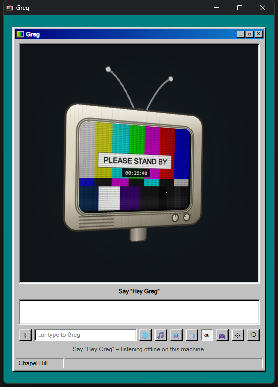

# Greg

A voice assistant with the face of an old television, running on your own PC.
Say **"Hey Greg"** and he answers out loud.

- **Hears you** — always listening for his name, no button to press
- **Talks back** — in a natural voice, and you can talk over him to stop him
- **Knows your weather and local news** — for wherever you are
- **Holds a conversation** — a real language model, on your own PC
- **Comes with you** — talk to him from your phone and get reminders as notifications ([how](docs/phone.md))

**No account, no subscription, no API key.** His brain, ears and voice all run
on your PC, so what you say stays there — unless you choose Claude as his brain
in Settings. Unplug the internet and he still
talks; he just can't fetch the weather or the news. If anything falls back to a
cloud service, his startup screen says so in amber.

## Install

For Windows 10 or 11.

1. Download **`Greg-Setup.exe`** from the [latest release](https://github.com/BakeryBread66/Greg-Tv-voice-assistant/releases/latest).
2. Run it. It isn't code-signed, so Windows may say *Windows protected your PC*:
   choose **More info → Run anyway**. It needs no administrator rights.
3. When Greg opens, his setup screen lists what he still needs — his brain,
   hearing and voice, about 10 GB, mostly the brain — and downloads it when you
   press **Install**.

To update, run a newer `Greg-Setup.exe`. To remove him, use Settings → Apps.
Updating never touches your settings, memory or conversations, and removing him
deletes them only if you tick the box that says so.

Linux, installing from a clone, the cloned voice and doing it all by hand are in
[docs/install.md](docs/install.md).

## What your PC needs

- **Chrome or Edge.** Edge comes with Windows.
- **About 10 GB of disk** for his brain, 16 GB if he should also see your screen.
- **A graphics card is optional.** With an NVIDIA card, about 6 GB of video
  memory runs him comfortably and 12 GB adds screen vision. On 8 GB, use
  [Mini Greg](docs/mini.md).

## Using him

Open **Greg** from the Start menu. A little television appears in the tray and
his window opens. Click **Wake Greg**, allow the microphone, and say:

> "Hey Greg, what's the weather?"

To stop him, close his window: he shuts down about fifteen seconds later. **Stop
Greg** in the tray menu does it straight away.

Nothing needs setting up. He finds your city on his own, and his settings live
in `config.json` and in **Settings** in his window.

## More

- **[His face and his channels](docs/channels.md)** — the television, all fourteen channels, the Global Dashboard
- **[Talking to Greg](docs/talking-to-greg.md)** — how a conversation flows, things to say, personality and personas
- **[What else he can do](docs/features.md)** — screen vision, music, files, subtitles, volume
- **[Giving him a different voice](docs/voices.md)** — cloning somebody from ten seconds of recording, and the Piper voices
- **[Greg on your phone](docs/phone.md)** — talking to him from anywhere, and reminders as notifications
- **[Installing in detail](docs/install.md)** — Linux, from a clone, by hand, and hardware
- **[Configuration](docs/configuration.md)** — every setting, and which need a restart
- **[Troubleshooting](docs/troubleshooting.md)** — when something is not working

**[DECISIONS.md](DECISIONS.md)** records the settings that look like obvious
improvements and are not, each with the measurement that settled it. Read it
before changing anything you think is wasteful.

## Credits

Greg was built by **BakeryBread66**.

## Licence

Greg is MIT licensed — see [LICENSE](LICENSE). Use it, change it, sell it; keep
the copyright notice.

That covers the code in this repository and nothing else. Greg is mostly a
conductor for other people's work, and the pieces that do the heavy lifting are
separate projects under their own terms:

**Installed by `npm install`.**
[three.js](https://github.com/mrdoob/three.js),
[globe.gl](https://github.com/vasturiano/globe.gl),
[three-globe](https://github.com/vasturiano/three-globe) and the
[Anthropic SDK](https://github.com/anthropics/anthropic-sdk-typescript) are MIT,
and [sherpa-onnx](https://github.com/k2-fsa/sherpa-onnx), which speaks his voice,
is Apache-2.0, at the versions pinned in `package-lock.json`. The country
outlines the dashboard draws come from
[Natural Earth](https://www.naturalearthdata.com/), which is public domain.

**Bundled in `Greg-Setup.exe`:** [Node.js](https://nodejs.org/), MIT, with its
licence beside it in `runtime\LICENSE`.

**Downloaded by the setup screen:** [whisper.cpp](https://github.com/ggml-org/whisper.cpp)
for his hearing (MIT), its models, the pronunciation data for his voice, and a
Piper voice. Each carries its own licence.

**Optional, installed with `pip`:** [faster-whisper](https://github.com/SYSTRAN/faster-whisper)
and [Piper](https://github.com/OHF-Voice/piper1-gpl), the older Python ears and
voice, and [Chatterbox](https://github.com/resemble-ai/chatterbox) with
[PyTorch](https://pytorch.org/) for the cloned voice. Check each licence before
you redistribute anything built on top.

**Voice models are their own thing again.** Piper voices are licensed
individually by whoever recorded them, and a Chatterbox clone is only ever as
licensed as the recording you point it at. Neither ships in this repo, which is
why `voices/` is gitignored.

**The data feeds are free and keyless, and none of them are ours.** NWS/NOAA and
USGS are US government work in the public domain; Open-Meteo, Google News RSS,
Yahoo's chart endpoint, OpenSky, NASA APOD and DuckDuckGo each have their own
terms and their own rate limits. Greg is a polite client — caching, backing off
and staying inside the anonymous quotas — but if you fork him into something
heavier, that is between you and them.

Ollama and whichever model you run under it are likewise separate; `gemma4:e4b`
and `qwen2.5vl:7b` carry their own model licences.

